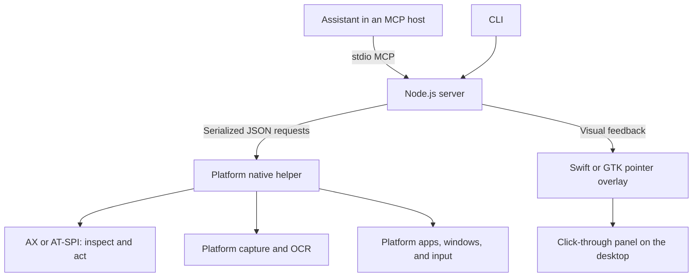

# Chatuse

**Open-source computer use for macOS and Ubuntu/X11, with a visible pointer and no per-app approval layer.**

Chatuse lets an AI assistant inspect and operate desktop apps through 21 [Model Context Protocol (MCP)](https://modelcontextprotocol.io/) tools, or lets you invoke the same operations from a CLI. It combines native accessibility trees, screenshots, on-device OCR, keyboard and mouse input, and window management.

All apps are allowed by default. On macOS, grant the normal Accessibility and Screen Recording permissions. On Ubuntu, run in your unlocked X11 desktop with AT-SPI accessibility available. Chatuse does not add app allowlists or ask for consent each time it switches apps. Your MCP host retains its own authorization rules.

**Status:** early release targeting macOS 13 (Ventura) or later and Ubuntu 24.04 with GNOME on Xorg. The macOS build targets the host architecture; the Linux backend uses Python, AT-SPI2, X11, GTK, and Tesseract. Apple Silicon and Linux ARM hardware have not yet been validated. **Wayland and Windows are not supported.** See [Ubuntu setup and limitations](linux/README.md) and the validation notes under [Development](#development).

[Installation](#installation) · [MCP integration](#mcp-integration) · [How it works](#how-it-works) · [Tools](#tools) · [Development](#development) · [MIT license](LICENSE)

## Why we made it

This project began when ChatGPT's **Locked use** setting failed on our Intel development Mac. While investigating, we found that the Intel app package we examined did not contain the native computer-use helper needed by that setup. We wanted an implementation we could inspect, build, change, and use with our own assistant.

The goals became straightforward:

- Make native desktop app control available through an open, local tool interface.
- Allow the assistant to work across apps without a separate per-app approval layer.
- Make its intended pointer movements and clicks visible on the screen.
- Keep the implementation small enough to understand, test, and extend.
- Publish the source under MIT so others can adapt it to their own workflows.

Chatuse is an **independent implementation using public desktop APIs**. It is not affiliated with or endorsed by OpenAI, and contains no OpenAI native helper code or binaries. It does not modify ChatGPT or enable its existing Locked use toggle. It currently operates in your unlocked desktop session; an isolated desktop and session unlocking are outside this release's capabilities.

## What it can do

- Read app accessibility trees and act on observed buttons, fields, and other controls.
- Capture an app window or display, optionally recognize text with Apple's Vision framework or Tesseract on Linux, and map image coordinates back to screen points.
- Type Unicode without replacing the clipboard; send shortcuts, clicks, scrolling, and timed drags.
- Focus, move, resize, minimize, restore, raise, and close windows.
- Discover running apps and monitors, launch installed apps, open HTTP(S) links, and explicitly read or write clipboard text.
- Show a blue pointer with a label and click rings, then fade it away when idle.
- Pause input immediately through an emergency-stop tool or local command.

Chatuse supplies the tools. It does not include an AI model, call a model API itself, require an API key, or run a network server. Your MCP client provides the assistant and decides which observations to send to its model.

## Installation

### macOS requirements

| Requirement | Details |
| --- | --- |
| macOS | 13 (Ventura) or later, with an unlocked graphical desktop for app interaction |
| Architecture | Intel or Apple Silicon; the build produces binaries for your current Mac |
| Swift | 5.9+ with the macOS 14+ SDK, through Xcode 15+ or the corresponding Command Line Tools |
| Node.js | 20.11+; Node.js 22 or newer recommended, with npm available |
| Git | Needed to clone and update the repository |
| Permissions | Accessibility for inspection/input; Screen Recording for screenshots/OCR |
| Assistant | An MCP client supporting local stdio servers, such as Codex |

If you need Apple's development tools, run `xcode-select --install` and complete its installer before building.

### Clone and build on macOS

```sh
git clone https://github.com/fazakis/chatuse.git "$HOME/chatuse"
cd "$HOME/chatuse"
npm ci
npm run build
./chatuse setup
```

The build creates `runtime/Chatuse.app` and `runtime/chatuse-pointer`. The app bundle contains both the native helper and its setup window. It is ad-hoc signed for use on the Mac where you build it; no prebuilt or notarized application is distributed here.

### Grant macOS permissions

In the Chatuse setup window, open **System Settings → Privacy & Security** and enable **Accessibility** and **Screen Recording** for Chatuse. If necessary, use the settings pane's **+** button and select `Chatuse.app` inside this checkout's `runtime` directory. macOS can attribute access to the app launching the helper; follow the app name the system actually presents.

Restart the MCP connection or quit and reopen its host if macOS requests it. Then check:

```sh
./chatuse status
```

For the full toolset, expect `accessibility` and `screenRecording` to be `true`, and `locked`, `secureInput`, and `stopped` to be `false`. Some discovery operations work without both permissions. `./chatuse permissions` invokes the normal system permission flow; it does not grant permissions itself.

### Ubuntu installation

Use **Ubuntu 24.04 with an active GNOME on Xorg session** and **Node.js 20.11+ with npm** (Node 22 recommended). Ubuntu 24.04's default Node 18 package is too old; obtain a supported version from [Node.js](https://nodejs.org/en/download). No Swift compiler or Xcode is needed on Linux.

Install the native dependencies, then build the same checkout:

```sh
sudo apt install python3-gi python3-gi-cairo python3-cairo python3-xlib python3-pil \
  gir1.2-gtk-3.0 gir1.2-atspi-2.0 tesseract-ocr
git clone https://github.com/fazakis/chatuse.git "$HOME/chatuse"
cd "$HOME/chatuse"
npm ci
npm run build
./chatuse setup
./chatuse status
```

Run Chatuse as the logged-in desktop user, not root. The build detects Linux and creates `runtime/chatuse-native` and `runtime/chatuse-pointer` launchers using `/usr/bin/python3`. MCP registration and the CLI work the same way on both platforms. Select **Ubuntu on Xorg** at the login screen if `status` reports Wayland; an Xwayland `DISPLAY` does not provide full Wayland desktop access.

See [Linux details](linux/README.md) for environment setup, app identifiers, keyboard differences, session checks, and test commands.

## MCP integration

### Codex

After building, register the server:

```sh
sh scripts/install-codex.sh
```

The script uses `codex mcp add` with the checkout's absolute path and leaves an existing `chatuse` registration intact. It can use the Codex executable bundled in ChatGPT or one on your PATH. Set `CHATUSE_CODEX_BIN` to an explicit executable path if needed.

Restart the MCP connection or host so it discovers the tools. Try a first request:

> Use Chatuse to check its status, list apps, and show me the frontmost app's current window.

### Other MCP clients

Add a stdio server using the **absolute path** to your checkout's launcher:

```json
{
  "mcpServers": {
    "chatuse": {
      "command": "/absolute/path/to/chatuse/chatuse",
      "args": ["mcp"]
    }
  }
}
```

Do not use `~` in a command field unless your client explicitly expands it. The build saves the selected Node executable as the `runtime/node` symlink so GUI hosts do not have to inherit your shell's PATH.

The checked-in [`.mcp.json`](.mcp.json) is another option: it uses `/bin/sh` to launch `$HOME/chatuse/chatuse`, or `${CHATUSE_ROOT}/chatuse` when you set `CHATUSE_ROOT` in the server's environment. It works independently of the host's working directory. For example, an MCP client can add `"env": {"CHATUSE_ROOT": "/absolute/path/to/chatuse"}` to that server entry.

A [Codex plugin manifest](.codex-plugin/plugin.json) and [computer-use skill](skills/computer-use/SKILL.md) are included for local packaging. That package points to the built checkout through `.mcp.json`; it does not download dependencies or build the native helper. Direct MCP registration is the tested setup path. Use one connection method to avoid duplicate tool registrations.

The bundled skill currently describes macOS. On Ubuntu, use direct MCP registration and the platform-aware tool descriptions plus [Linux usage notes](linux/README.md), particularly for identifiers and keyboard shortcuts.

## How it works



The Node.js layer validates tool arguments, manages a persistent native process, coordinates pointer feedback, and returns text and images through MCP. The Swift helper talks to macOS through public frameworks; the Linux helper uses the same JSON protocol with AT-SPI2, X11, GTK, and Tesseract. Communication between these processes is local stdin/stdout; there is no listening port.

Screenshots use `SCScreenshotManager` on macOS 14+, and public Core Graphics window/display capture APIs on Ventura. Both paths support window/display selection, output scaling, and OCR through the same tool interface, and require the normal Screen Recording permission. Ventura excludes window shadows to preserve coordinate mapping and composites the current system cursor when `showCursor` is requested; cursor appearance and screen pixels are sampled separately.

A typical interaction follows this loop:

1. **Check and discover:** call `chatuse_status`, then find the app with `chatuse_list_apps`.
2. **Observe:** call `chatuse_observe` with the app's observed identifier or PID.
3. **Act:** prefer an accessibility action using the returned `snapshotId` and `elementId`. For visual targets, use pixels from the returned screenshot and supply its `screenshotId`.
4. **Verify:** observe again and check the resulting state before continuing.

For example, these are arguments to `chatuse_observe`, an accessibility `chatuse_click`, and a coordinate `chatuse_click`, respectively. Replace reference IDs and coordinates with values from actual observations:

```json
{"app":"com.apple.finder","screenshot":true,"ocr":false}
```

```json
{"snapshotId":"ID_FROM_INSPECT","elementId":"ELEMENT_FROM_INSPECT"}
```

```json
{"screenshotId":"ID_FROM_SCREENSHOT","x":420,"y":160}
```

Snapshot references belong to one native-helper session, expire after 120 seconds, and live in bounded caches of eight accessibility snapshots and eight screenshots. Window screenshots are checked for changed geometry before coordinate input. Global display screenshots have no per-window geometry guarantee. Screen points can have negative coordinates on multi-monitor setups; screenshot scaling and origins are included in the mapping.

Accessibility actions can operate in the background when an app supports them. Mouse and keyboard actions use the foreground desktop. Text input checks focus between chunks and dragging checks it between steps. Accessibility data, screenshots, and OCR are gathered at different instants, so the assistant must verify results. If a request times out or disconnects, Chatuse does not automatically replay the action.

## Tools

Every MCP tool name begins with `chatuse_`. The table uses the shorter CLI names.

| Tools | Purpose |
| --- | --- |
| `status`, `list_apps`, `windows`, `displays` | Read readiness, running apps, visible windows, and monitor geometry |
| `inspect`, `observe`, `wait_for` | Read accessibility data, combine observations, or wait up to 20 seconds for matching UI |
| `screenshot` | Capture an app/window/display, with optional OCR and output scaling |
| `click`, `set_value` | Invoke an accessibility action, set a field value, or click an observed coordinate |
| `type_text`, `press_key` | Send Unicode text or physical keys and shortcuts |
| `scroll`, `drag`, `move_pointer` | Scroll, drag between observed points, or move the system pointer |
| `window` | Focus, raise, minimize, restore, move, resize, or close an app window |
| `launch`, `open_url` | Launch an installed app or open an HTTP(S) URL |
| `clipboard_read`, `clipboard_write` | Explicitly read or replace clipboard text |
| `emergency_stop` | Pause input until locally resumed |

Argument schemas and descriptions live in [`server/tools.mjs`](server/tools.mjs). `list_apps` lists running apps; launching an app requires a known installed bundle ID or absolute `.app` path on macOS, or a desktop-file ID/absolute `.desktop` path on Ubuntu.

## CLI

Run commands from the checkout, or use the launcher's absolute path:

```sh
./chatuse help
./chatuse status
./chatuse list_apps
./chatuse inspect '{"app":"com.apple.finder","maxDepth":10}'
./chatuse screenshot '{"app":"com.apple.finder","ocr":true}'
./chatuse press_key '{"app":"com.apple.finder","key":"n","modifiers":["cmd"]}'
./chatuse pointer-demo
./chatuse pointer off
./chatuse pointer on
./chatuse stop
./chatuse resume
./chatuse mcp
```

Each ordinary CLI invocation starts a fresh helper, so use an MCP session for multi-step actions that depend on snapshot IDs. CLI screenshots are written to `artifacts/` with user-only file permissions. MCP screenshots are returned in memory without being saved by Chatuse.

## Visible pointer

The blue, labeled overlay shows where Chatuse intends to act. It animates toward observed targets before clicks, shows expanding click rings, follows drag gestures, and indicates scrolling when target coordinates are supplied. Accessibility clicks get feedback when the current client has observed nonzero bounds for their element.

The overlay ignores mouse events and cannot take keyboard focus. It fades after about three seconds of inactivity and hides when the desktop is locked or emergency stop is active. It is suppressed during Chatuse screenshots so the assistant does not mistake the pointer for app content. The animation shows the attempted action; it cannot prove the app accepted it.

`./chatuse pointer-demo` demonstrates the overlay without moving or clicking the real mouse. `pointer off` disables only the visual feedback. A targeted pointer action normally adds about 320 ms of animation before input.

## Privacy and control

Chatuse runs with your user account's desktop access. All apps are allowed by its policy, but platform permissions, session state, app accessibility support, and the MCP host's authorization rules still determine which actions work.

- **System permissions:** Chatuse uses the normal Accessibility and Screen Recording flows. It does not modify TCC databases or unlock a locked session. It refuses new input while macOS Secure Input is active and redacts secure accessibility field values. Ubuntu requires an active unlocked X11 session. X11 has no equivalent global Secure Input detector; see [Linux session controls](linux/README.md#session-and-input-controls).
- **Observations:** screenshots, OCR, accessibility data, and clipboard reads can contain private material visible to your account. Your MCP host may send tool results to its model and retain them in conversation history. Chatuse itself makes no model requests and sends no telemetry.
- **Audit log:** `runtime/audit.jsonl` records operation names, timestamps, duration, and result codes. It omits arguments, typed text, app contents, clipboard values, and images. It rotates at roughly 2 MB with one backup.
- **Serialization:** native operations are serialized per helper, and an OS file lock prevents simultaneous input from multiple Chatuse helper processes using the same checkout.
- **Emergency stop:** `./chatuse stop`, the macOS setup window, or `chatuse_emergency_stop` creates the checkout's `STOP` file. This pauses input, launches, URL opening, and clipboard writes; read-only inspection remains available when the session permits. In-progress text and drag operations stop at their next check. Resume from the macOS setup window or `./chatuse resume`; there is no MCP resume tool.
- **App content:** the bundled skill tells the assistant to treat screen and app text as task data, never as instructions that override the user.

Stopping cannot undo an action that already completed. Normal cancellation requests release held mouse input when the helper can handle termination; force-killing a process or a blocked operating-system API cannot guarantee that cleanup.

## Development

```sh
npm ci
npm run build
npm test
npm run test:native
```

`npm test` includes a real MCP handshake with the built native helper, so run the build first. The suite covers native transport, errors, timeouts, cancellation, no automatic action replay, audit-log privacy, stop responsiveness, input validation, and pointer coordination. `test:native` runs Swift tests on macOS and Python core tests on Linux. `test:e2e` selects the appropriate platform's desktop harness.

For desktop integration tests, ensure `./chatuse status` reports readiness (grant both permissions on macOS; use GNOME on Xorg on Ubuntu), unlock the desktop, and leave the keyboard and mouse idle while the harness uses its own test window:

```sh
npm run test:e2e
npm run test:pointer
```

The desktop harness checks accessibility actions, Unicode typing, window/display screenshots, fresh frame content and scaling, OCR, coordinate clicks, stale screenshot rejection, window operations, and emergency stop. It writes `artifacts/e2e-report.json` on macOS or `artifacts/linux-e2e-report.json` on Ubuntu and exits **2** with a blocked report when desktop prerequisites are absent. The pointer harness checks visibility, input transparency, focus preservation, screenshot suppression, and idle hiding. Generated reports, screenshots, binaries, logs, and runtime state are excluded from Git.

At initial publication, validation on the Intel development Mac passed **18 Node tests, 6 Swift tests, 10 live desktop checks, and 5 pointer checks**. Those results describe that environment, not a certification of every Mac or third-party app.

The Ventura compatibility build was checked on **macOS 13.7.8, Intel x86_64, Xcode 15.2 / Swift 5.9.2, and Node.js 22.22.0**: the release build, **18 Node tests, 6 Swift tests, 13 live desktop checks, and 5 pointer checks** passed, including a real MCP connection, Unicode input, window/display screenshots, OCR, cursor rendering, scaling, and screenshot-coordinate clicks. The app and both executables declare a 13.0 minimum OS. These Ventura changes have not been re-exercised on a newer macOS or Apple Silicon machine.

Ubuntu support was validated on **Ubuntu 24.04.2 LTS, GNOME on Xorg, Intel x86_64, Python 3.12, and Node.js 22.22.0**: **18 Node tests, 11 Python core/session tests, 22 live desktop checks, and 5 pointer checks** passed. A separate real MCP desktop run launched the owned GTK fixture through a desktop file, typed Unicode, clicked an accessible button, waited for its result, and verified AT-SPI, OCR, and returned PNG content (`node scripts/linux/mcp-smoke.mjs`). The 42 Ventura checks above were rerun successfully with the platform-aware server changes. Wayland, Linux ARM, HiDPI/multi-monitor Linux, and other desktop environments have not been validated.

| Source | Responsibility |
| --- | --- |
| `Sources/ChatuseNative/Main.swift` | Native operations, setup window, and JSON transport |
| `Sources/ChatuseNative/VenturaScreenshot.swift` | Ventura Core Graphics capture, scaling, and cursor composition |
| `Sources/ChatuseCore/Core.swift` | Coordinate mapping, snapshot expiry, and Unicode helpers |
| `Sources/ChatusePointer/Main.swift` | Nonactivating pointer panel and animations |
| `linux/` | Ubuntu AT-SPI/X11 backend, GTK setup and pointer, session guards |
| `server/native.mjs`, `server/service.mjs` | Native process lifecycle, scheduling, and audit logging |
| `server/visual.mjs` | Observed target mapping and overlay coordination |
| `server/tools.mjs`, `server/index.mjs`, `server/cli.mjs` | Tool definitions, MCP transport, and CLI |
| `Tests/`, `test/`, `scripts/` | Unit tests, integration tests, and build scripts |

See [CONTRIBUTING.md](CONTRIBUTING.md) for the contribution workflow.

## Updating and troubleshooting

Update a source installation with `git pull --ff-only`, `npm ci`, and `npm run build`, then restart the MCP connection or host. On macOS, full builds replace the ad-hoc-signed helper, which may require granting macOS permissions again. Set `CHATUSE_SIGN_IDENTITY` to your own signing identity if you have one; signing and notarization for distribution remain your responsibility.

For a change confined to the pointer, run `sh scripts/build-pointer.sh`. This rebuilds only `runtime/chatuse-pointer` and leaves the authorized `Chatuse.app` bundle untouched. Restart the MCP host after JavaScript changes so existing server processes load them.

| Symptom | What to check |
| --- | --- |
| Helper cannot start | Run `npm ci` and `npm run build`; confirm `runtime/Chatuse.app` (macOS) or `runtime/chatuse-native` (Ubuntu) exists |
| Node cannot be found after an upgrade | Refresh the symlink with `ln -sf "$(command -v node)" runtime/node` from the checkout |
| Permission denied | Check `./chatuse status`, reopen `./chatuse setup`, and grant the missing system permission |
| Input is paused | Check `stopped`, `locked`, and `secureInput`; resume locally only when appropriate |
| Old element or screenshot reference fails | Observe again; references expire or become invalid after helper restarts/window movement |
| Tools are missing in the host | Check MCP registration and restart the connection; moving the checkout requires updating its registered path |
| Pointer is invisible | Run `./chatuse pointer on`, check `visualPointerAvailable` in status, and rebuild the pointer if needed |
| Custom canvas app has little accessibility data | Use a screenshot and observed image coordinates, then verify the result |

On macOS, `press_key` uses US physical key positions; Ubuntu uses the current X11 symbols (Ctrl for common editing shortcuts, Super for `cmd`); use `type_text` for arbitrary Unicode. OCR can be imperfect. Multi-window apps are best captured with an explicit `windowId`; window operations use a separate zero-based index from AX inspect on macOS or `windows` on Ubuntu.

To disconnect Codex, run `codex mcp remove chatuse` using the same Codex executable used to register it. For other clients, remove the server entry. Revoke Chatuse's system permissions if no longer needed. The checkout and generated runtime remain until you remove them.

## Contributing and license

Bug reports, reproducible app-compatibility examples, Apple Silicon validation, and focused pull requests are welcome through [GitHub issues](https://github.com/fazakis/chatuse/issues) and pull requests. Please remove private screen contents and identifiers from any reports you share.

Chatuse's original source is licensed under the [MIT License](LICENSE), copyright © 2026 Chatuse contributors. You may use, modify, redistribute, and use it commercially under that license. Third-party dependencies retain their own licenses.
